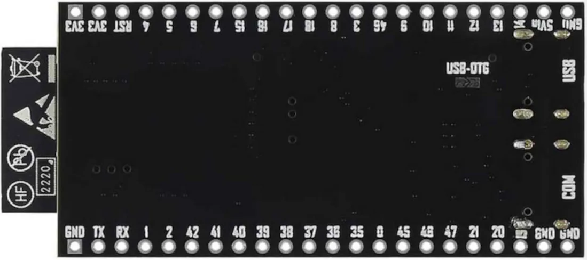

# RadioESP32S3
## Introduction
&nbsp;&nbsp;&nbsp;&nbsp;Some time ago I published the [RadioESP32](https://github.com/Pako2/RadioESP32) project. It was intended exclusively for the basic ESP32 chips. I realized that it would be good to also try a variant with the more modern ESP32-S3 chip and this is the result. Since almost everything is identical to the original project, I will mainly emphasize the differences here.\
&nbsp;&nbsp;&nbsp;&nbsp;Complete project documentation can be found in the [UserGuide_EN.pdf](doc/UserGuide_EN.pdf) file.

## How to install
Experienced Tinkerers who have installed VS Code with PlatformIO supplement and normally use it probably do not need any other advice. Everything is described in the previous text. However, there may be some less experienced users who are interested in trying the project and do not need to make their own modifications. In this case, they can use pre-compiled binaries and install them in ESP32-S3 without VS Code/Platformio.
The procedure is as follows (valid only to Windows users):
1. The default assumption is that the development kit is connected to the USB port of your computer and you know the number of (virtual) COM port. Suppose it's a *COM10*. Use the connector marked *COM* (not *USB*) on the development kit.
2. Download the latest [RadioESP32S3_binaries.zip](https://github.com/Pako2/RadioESP32S3/releases/latest/download/RadioESP32S3_binaries.zip) and unpack the ZIP file to some suitable (work) folder.
3. In the selected folder, the **bin** folder appears that contains everything you need.
4. Open the command line window (**cmd.exe**) so that you are in the above folder **bin**.
5. Enter the **flash.bat** command. The following offer should appear:

  

6. Select the desired firmware version (ie press the appropriate number) and then press Enter.
7. You will then be prompted to enter a COM port. Write the corresponding name (by example in point **1** it would be *COM10*) and press Enter.
8. There should be installed the necessary SW into ESP32.
9. After completion you can continue according to the **First start** chapter.

<ins>Note:</ins>\
The *withota* and *withotanodisp* versions are intended for production use, while the *noota* and *nootanodisp* versions are intended primarily for the development phase (as they allow comfortable editing of web server files). However, there is nothing to prevent the *noota* and *nootanodisp* versions from being used for production use as well.

## First start
When the device is started for the first time, it runs in default settings and in AP mode. On the PC, connect to the **RadioESP32S3** network and in the browser to the address **192.168.4.1**. A web page should appear through which the device settings need to be made.

## Design of the device
The circuit diagram and printed circuit board were created using the Eagle design system.
### Wiring diagram

### Printed circuit board

  
   

## Choice of components
The basis of the design is the development kit "ESP32-S3-DevKitC-1" (shorter wider version). The board must have at least 8MB of flash memory and 4MB of PSRAM memory.

   
   

## Choice of GPIO
I designed and used a PCB where the assignment of GPIOs for various functions is therefore fixed. But this is not fixed in the software. In fact, it is the opposite, most GPIOs can be selected by the user, so it should be easy to use a different connection than the PCB I designed.
However, there are two exceptions:
1. Display connection - this must be set in the *platformio.ini* file before compilation.
2. Selection of ADC channel for battery measurement (I chose channel adc1-6, which corresponds to GPIO 7)

<ins>Note:</ins>\
In the original design with the ESP32 base chip, there is a third exception - connecting an SD card in SD_MMC mode. Fortunately, there is no such exception here, because in this case (ESP32-S3 chip) any GPIO pin can be used. This is of course a huge advantage, because the problems that were with the ESP32 base chip (there GPIO2, which is one of the bootstrapping pins, had to be used) have disappeared.

## Assembled board
Finally, you can see a few pictures of the printed circuit board completely assembled and including the installed subboards (ESP32 development kit and DAC). I also added one photo of the finished radio (without the cover).

### License
The code parts written by the author of the **RadioESP32S3** project are licensed under [GPL-3.0](LICENSE), 3rd party libraries that are used by this project are licensed under different license schemes, please check them out as well.

